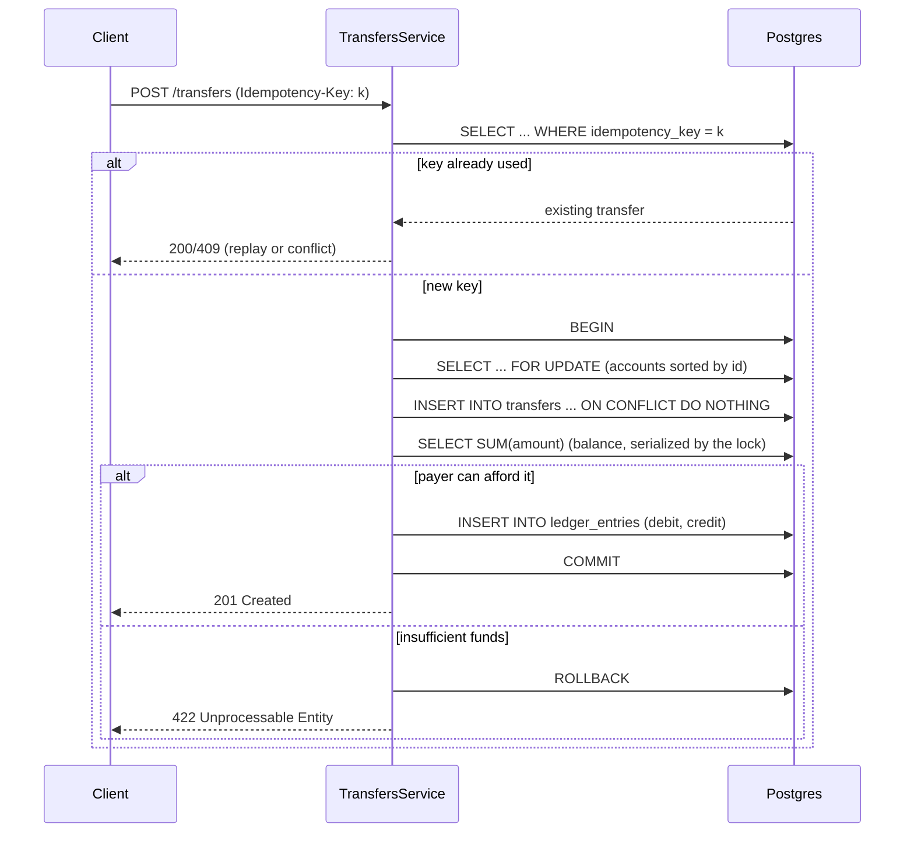
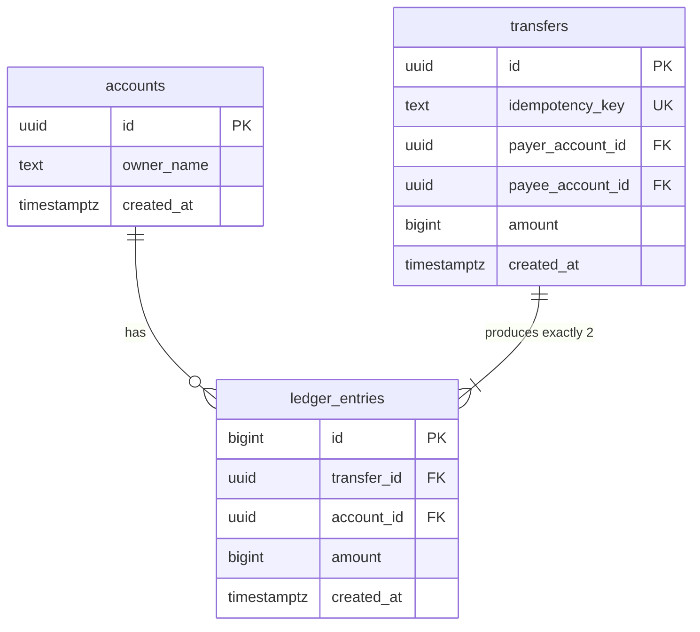

# distributed-payment-ledger

A double-entry payment ledger built with NestJS and PostgreSQL — a "mini-Pix" instant-payment core, evolving into a distributed clearing system across two services.

## Roadmap

- [x] Service scaffold: NestJS, PostgreSQL, SQL migrations, health check
- [x] Domain model: money as integer cents, accounts, transfer invariants
- [x] Append-only double-entry ledger with derived balances
- [x] Atomic transfers: per-account locking + idempotency keys
- [x] Integration test suite: concurrency and retry guarantees
- [x] Full documentation with architecture diagrams
- [ ] Outbox pattern + message broker
- [ ] Second bank service + transfer saga with compensation
- [ ] Reconciliation job

## Design rationale

**Money is never a float.** `Money` (`src/domain/money.ts`) wraps a signed integer number of cents and rejects anything that isn't a safe integer. Every arithmetic op returns a new `Money`, so a rounding bug can't silently enter through a stray `0.1 + 0.2`.

**The ledger is the source of truth; balances are derived, never stored.** `ledger_entries` is append-only — `UPDATE`/`DELETE` are rejected by a database trigger, not just application convention — so a balance is always `SUM(amount)` over history (`LedgerRepository.balanceOf`). A correction is a new entry, never a rewrite. This is the same reasoning production ledgers use: the audit trail *is* the data structure, not a side effect of it.

**A transfer is two entries that must sum to zero.** `Transfer.entries()` produces a debit on the payer and a credit on the payee for the same amount, inserted in the same transaction. There's no code path that can create money — the invariant is enforced by construction, not by a reconciliation job checking after the fact.

**Overdraft is impossible under concurrency, not just unlikely.** A transfer takes `FOR UPDATE` row locks on both accounts, sorted by id, before reading a balance — see [Locking discipline](#locking-discipline) below. This is verified, not assumed: `transfers.integration.spec.ts` fires ten concurrent transfers against a balance that can only cover seven and asserts exactly seven succeed and the balance never goes negative.

**Retried requests can't move money twice.** Every transfer carries a client-supplied `Idempotency-Key`. The key has a unique DB constraint; a retry with the same key and payload replays the original result, and a retry with the same key but a different payload is rejected as a conflict (`IdempotencyConflictError`, HTTP 409) rather than silently doing the wrong thing.

**The domain layer imports nothing from NestJS or pg.** `src/domain/*` has zero framework dependencies — `Money`, `Account`, `Transfer` are plain TypeScript classes with their own unit tests (`money.spec.ts`, `transfer.spec.ts`). Framework code (controllers, repositories, modules) sits in a shell around it and is exercised by the integration suite instead.

## Locking discipline

Two accounts are involved in every transfer, and two concurrent transfers can involve the same pair in opposite directions (A→B and B→A at the same time). Locking them in a fixed order — sorted by UUID — means every transaction acquires locks in the same global order, so a deadlock between opposing transfers is structurally impossible rather than merely handled via retry.



## Data model



`transfers` and `ledger_entries` are both append-only (enforced by `BEFORE UPDATE OR DELETE` triggers). `ledger_entries.amount` is signed and always comes in pairs that sum to zero for a given `transfer_id`; `accounts` has no balance column at all.

## API

| Method | Path                     | Notes                                          |
| ------ | ------------------------ | ----------------------------------------------- |
| POST   | `/accounts`               | `{ ownerName }`                                 |
| GET    | `/accounts/:id`           |                                                  |
| GET    | `/accounts/:id/balance`   | Derived from `ledger_entries`, not stored        |
| GET    | `/accounts/:id/statement` | Most recent entries, newest first                |
| POST   | `/transfers`              | Requires `Idempotency-Key` header                |
| GET    | `/transfers/:id`          |                                                  |

There is currently no endpoint that injects money into the system (no faucet/mint) — every transfer needs a payer with a prior positive balance, which is the correct instant-payment model but means a fresh database has to be seeded directly (see the integration test's `openWithBalance` helper) to exercise a non-trivial transfer by hand.

## Running

```sh
nvm use
npm install
docker compose up -d
npm run migrate
npm run start:dev
```

Health check: `curl http://localhost:3000/health`

## Testing

```sh
npm test    # unit tests (domain) + integration tests (real Postgres)
npm run lint
```

The integration suite (`src/transfers/transfers.integration.spec.ts`) requires `docker compose up -d` and `npm run migrate` to have been run first — it exercises real row locks, not mocks.

## What's next

The next milestone turns this into a distributed system: an outbox table + poller publishes committed transfers to a broker, a second bank service consumes them, and a saga with compensating transactions handles the case where the second leg fails after the first has committed — the interesting distributed-systems problem this single-service ledger can't demonstrate on its own.
