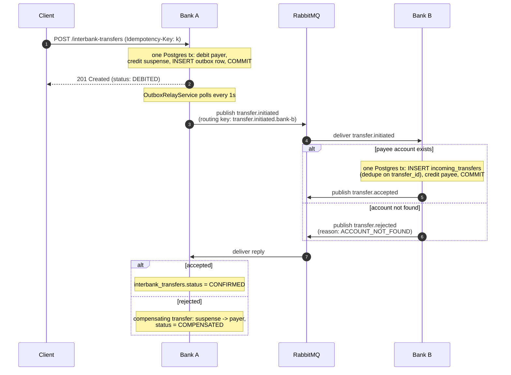
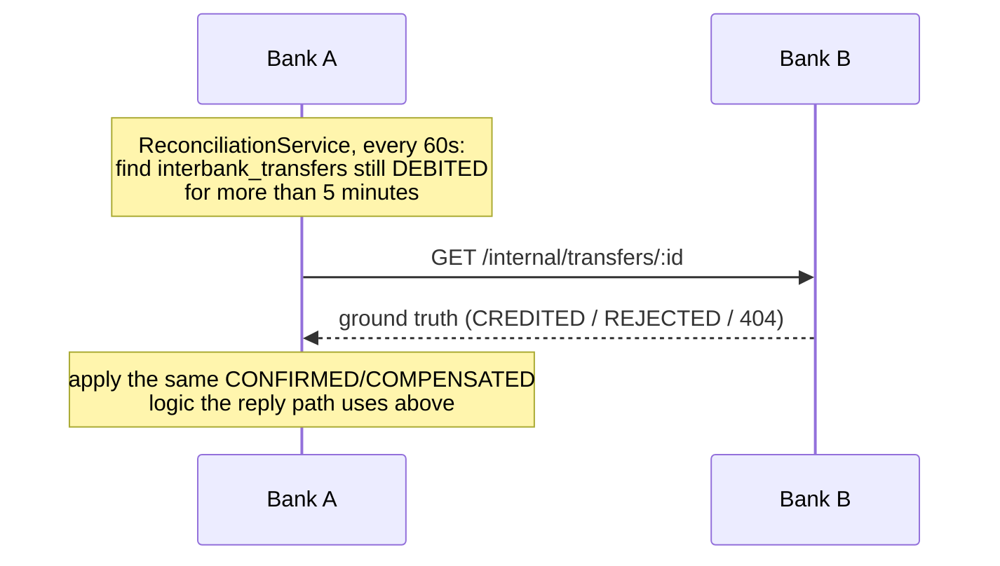
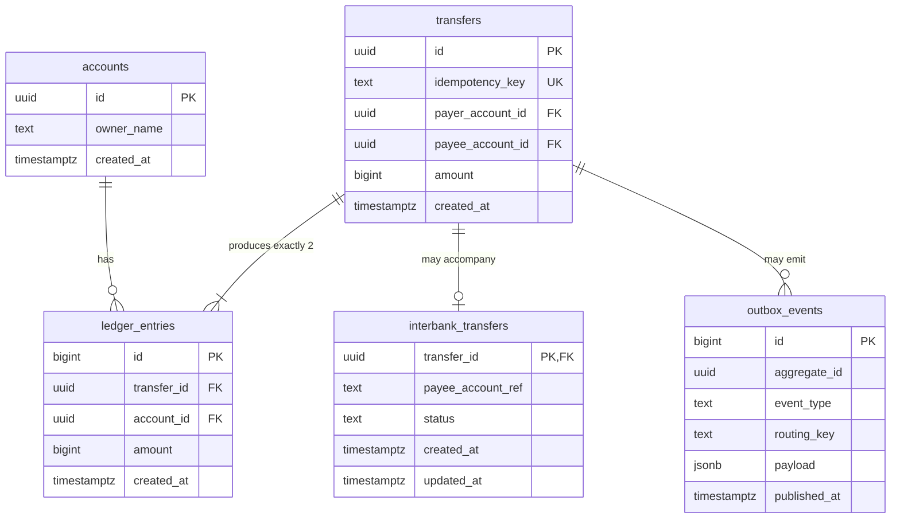

# distributed-payment-ledger

A double-entry payment ledger built with NestJS and PostgreSQL — a "mini-Pix" instant-payment core, evolved into a distributed clearing system between two independent bank services (Bank A in NestJS, Bank B in FastAPI) that settle transfers through a message broker.

## Why two banks

A single-database ledger can make a transfer atomic for free — one Postgres transaction, one commit, done. Real interbank transfers can't: Bank A and Bank B have separate databases that can't share a transaction, and distributed two-phase commit isn't used in practice because a crashed coordinator leaves every participant blocked holding locks indefinitely. So milestone 2 is a deliberately harder, more realistic problem: move money between two systems that can only coordinate through asynchronous messages, without ever losing or duplicating it, given that any message can be delayed, lost, or delivered twice.

## Two-bank architecture

```
┌──────────────────────┐                                    ┌──────────────────────┐
│   Bank A (NestJS)     │        RabbitMQ topic exchange     │   Bank B (FastAPI)    │
│   src/                │           "bank-transfers"         │   bank-b/             │
│                       │  ───── transfer.initiated.bank-b ─▶│                       │
│  accounts, transfers  │                                    │  inbound consumer     │
│  outbox + relay       │◀──── transfer.reply.bank-a ─────── │  idempotent crediting │
│  reply consumer       │                                    │  own suspense account │
│  compensation logic   │                                    │                       │
│  reconciliation sweep │─────── GET /internal/transfers/:id▶│  internal endpoint    │
│                       │                                    │                       │
│  Postgres :5433       │                                    │  Postgres :5434       │
└──────────────────────┘                                    └──────────────────────┘
```

Each bank owns its database outright and never queries the other's — the only contract between them is the shape of the events on `bank-transfers` and, for reconciliation, one internal HTTP endpoint. A transfer to Bank B is booked locally at Bank A as an ordinary transfer to a well-known **suspense (transit) account** (`00000000-0000-0000-0000-000000000001`), so Bank A's own double-entry invariant — every transfer sums to zero — never has to bend for the fact that the money is, for a while, headed somewhere Bank A can't see into. Bank B does the mirror image on its side: crediting a payee for money arriving from Bank A is paired with a debit to Bank B's own suspense account.

A visual, editable version of this diagram is in [`architecture.excalidraw`](./architecture.excalidraw) — open it at [excalidraw.com](https://excalidraw.com) (File → Open) or with the Excalidraw VS Code extension.

## The saga



That's the event-driven path — every step above is a real message, and it's what settles the vast majority of transfers within milliseconds. It doesn't cover one case: the reply (or `transfer.initiated` itself) never arriving at all. That's handled by a completely separate, independent process:



Three independent mechanisms make this safe under real-world failure, each solving a different distributed-systems problem:

**The transactional outbox solves the dual-write problem.** Debiting the payer in Postgres and publishing to RabbitMQ are two separate systems that can't be updated atomically. Writing the event as a row in `outbox_events` inside the same transaction as the debit means the event exists if and only if the debit happened; a separate poller (`OutboxRelayService`, `SELECT ... FOR UPDATE SKIP LOCKED` so multiple instances can run without double-publishing) publishes it afterward, safe to retry indefinitely.

**Idempotency keys make every step safe to redeliver.** RabbitMQ is at-least-once, not exactly-once — a message can be delivered twice. Bank B's `incoming_transfers.transfer_id` and Bank A's compensation key (`compensation-<transferId>`) both use `INSERT ... ON CONFLICT DO NOTHING`, so a redelivered message credits or compensates once, not twice — verified under literal concurrent delivery, not just sequential retries (see `interbank-transfers.integration.spec.ts` and `bank-b/tests/transfers/test_service.py`).

**Reconciliation is the safety net for messages that never arrive at all.** The saga above handles success and explicit rejection; it does not handle a message silently vanishing — a broker restart, a purged queue. `ReconciliationService` sweeps for transfers stuck `DEBITED` past a threshold comfortably longer than normal processing time, asks Bank B directly instead of waiting on an event that may never come, and applies whatever the truth turns out to be. This was verified against the real running scheduler, not just a test: a transfer was manually reset to `DEBITED` with a backdated timestamp, and the actual 60-second interval in a live process found and fixed it via a real HTTP call to a real Bank B.

Deeper design rationale — why suspense accounts instead of some other approach, why choreography over orchestration, what two-phase commit gets wrong, how this relates to CAP — is written up with references in `study.md` (gitignored; personal study notes, not part of this deliverable).

## Data model



`transfers` and `ledger_entries` are append-only, enforced by `BEFORE UPDATE OR DELETE` triggers — a compensation is a new `transfers` row, never a rewrite of the original debit. `interbank_transfers` is the one deliberately mutable table in the schema: it tracks in-flight saga *process* state (`DEBITED` → `CONFIRMED`/`COMPENSATED`), not money-of-record — the money itself is already final in `ledger_entries` the instant the local debit commits. Bank B's schema (`bank-b/migrations/`) mirrors `accounts`/`ledger_entries` and adds `incoming_transfers`, keyed on the `transfer_id` Bank A generated — the single dedupe key that threads through the whole saga.

## API

**Bank A** (`http://localhost:3000`)

| Method | Path                          | Notes                                                        |
| ------ | ------------------------------ | ------------------------------------------------------------- |
| POST   | `/accounts`                    | `{ ownerName }`                                                |
| GET    | `/accounts/:id`                |                                                                 |
| GET    | `/accounts/:id/balance`        | Derived from `ledger_entries`, not stored                      |
| GET    | `/accounts/:id/statement`      | Most recent entries, newest first                              |
| POST   | `/transfers`                   | Local A→A transfer. Requires `Idempotency-Key` header           |
| GET    | `/transfers/:id`               |                                                                 |
| POST   | `/interbank-transfers`         | A→B transfer. `{ payerAccountId, payeeAccountRef, amountCents }`, requires `Idempotency-Key` |
| GET    | `/interbank-transfers/:id`     | Includes saga `status`: `DEBITED` / `CONFIRMED` / `COMPENSATED` |

**Bank B** (`http://localhost:8001`)

| Method | Path                          | Notes                                                        |
| ------ | ------------------------------ | ------------------------------------------------------------- |
| POST   | `/accounts`                    | `{ owner_name }`                                                |
| GET    | `/accounts/:id`                |                                                                 |
| GET    | `/accounts/:id/balance`        |                                                                 |
| GET    | `/accounts/:id/statement`      |                                                                 |
| GET    | `/internal/transfers/:id`      | Ground truth used by Bank A's reconciliation sweep — not meant for public/client use |

Neither bank has a general-purpose faucet/mint endpoint — every account starts at zero. The one exception is `POST /accounts/:id/dev-seed` on Bank A, which funds an account from a well-known dev-treasury account via an ordinary double-entry transfer (same mechanism the integration tests' `openWithBalance` helper uses). It exists solely so the [demo frontend](#demo-frontend) below has something to click; it's not part of the API design.

## Running

Both banks, RabbitMQ, and both Postgres instances:

```sh
docker compose up -d

nvm use
npm install
npm run migrate
npm run start:dev          # Bank A on :3000

cd bank-b
poetry install
poetry run python scripts/migrate.py
poetry run uvicorn app.main:app --port 8001 --reload   # Bank B on :8001
```

Health checks: `curl http://localhost:3000/health` and `curl http://localhost:8001/health`. RabbitMQ's management UI is at `http://localhost:15672` (guest/guest).

## Demo frontend

A small React (Vite) app in `frontend/` drives both banks directly from the browser — create an account on each side, fund the payer, send a transfer, and watch its saga status flip from `DEBITED` to `CONFIRMED` (or `COMPENSATED`) in real time as it polls Bank A.

```sh
cd frontend
npm install
npm run dev   # http://localhost:5173
```

Needs Bank A and Bank B already running (see above) — both have CORS open for local development. Copy `.env.example` to `.env` to point it at non-default ports.

## Testing

```sh
npm test          # Bank A: unit + integration tests (real Postgres/RabbitMQ)
npm run test:e2e  # spawns the real compiled Bank A + real Bank B and drives the saga over HTTP
npm run lint

cd bank-b
poetry run pytest       # Bank B: unit + integration tests (real Postgres)
poetry run ruff check .
poetry run mypy app scripts tests
```

`npm test` and `poetry run pytest` need `docker compose up -d` and both banks' migrations applied first. `npm run test:e2e` additionally builds Bank A and needs `bank-b/`'s dependencies installed (`poetry install`) — it spawns both real processes itself, so no server needs to already be running, but ports 3000 and 8001 must be free.
